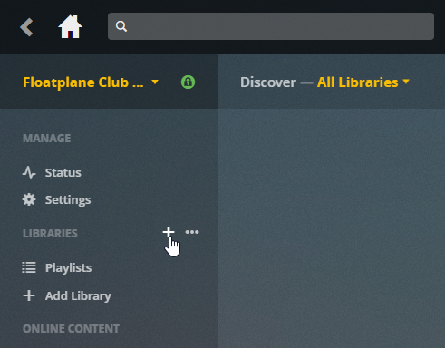
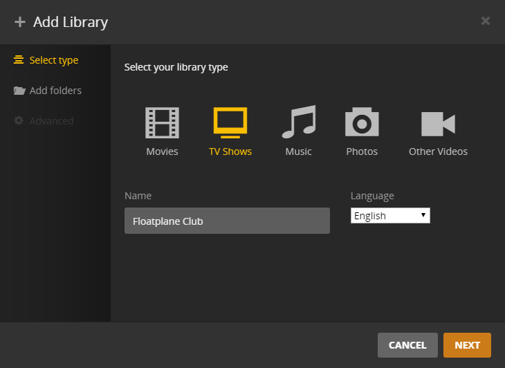
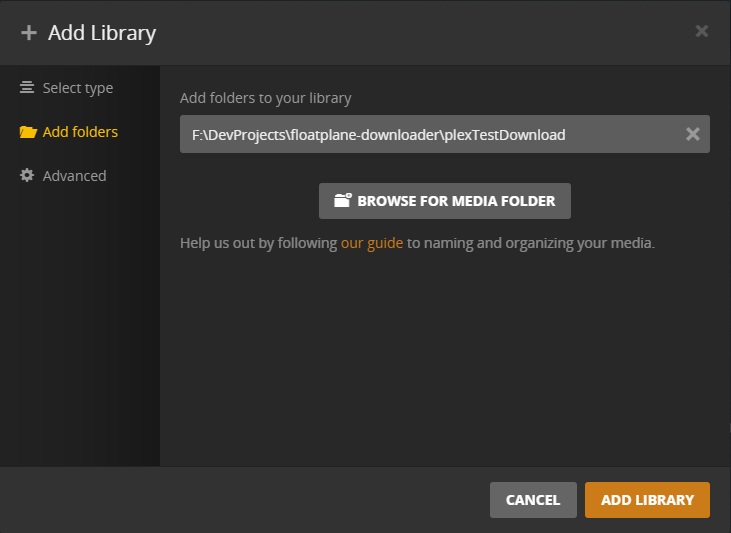
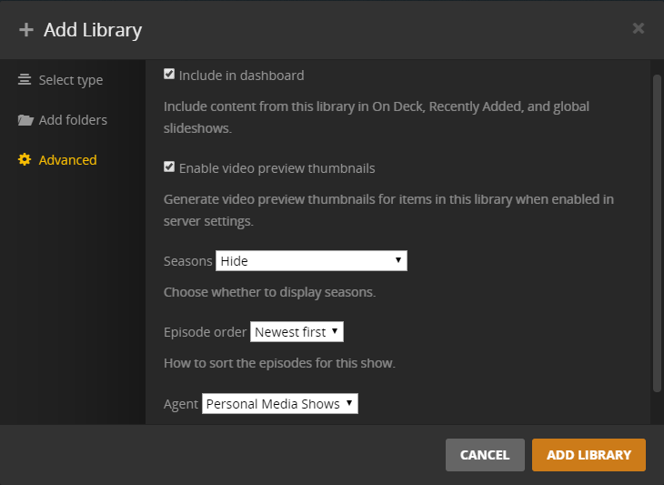
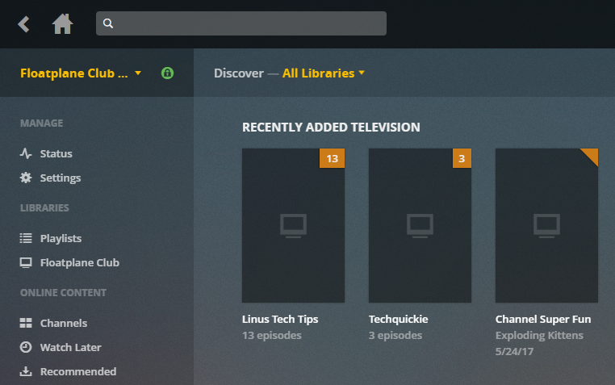
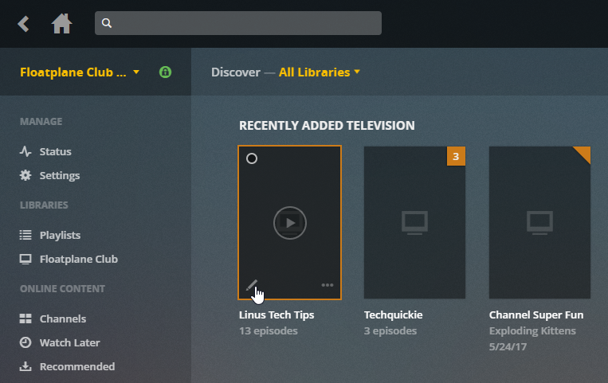
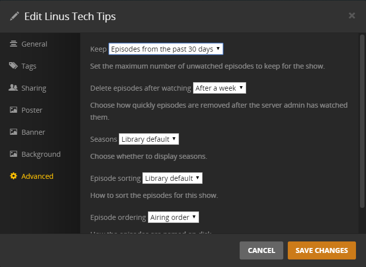

Configure Plex
-------

First, we gonna create a library for *Floatplane Club* videos:

In the "*Add Library*" make sure that you selected "TV Shows" as the library type. You can name it like you want, here I named my library "*Floatplane Club*". Language is not important as we don't get metadatas from others services.

Then, in the "*Add folder*" tab, add the folder you choose as the "plexFolder" value in your config file.

In the "*Advanced*" tab, set everything exactly as this screenshot. The more important setting is the "*Agent*".

Set it to "Personal Media Shows" makes Plex get the title from the video instead of the date as the video name, like others Plex agents would do.

After you added your library, your shows should show up and look somewhat like this.

### Advanced(-ish) configuration

To be sure that older videos won't eat your disk space, Plex have a built in option to delete videos older than a certain date. The only issue is that you have to set it to each show, one by one.

To configure this, simply hover on the show you want to configure and click on the edit icon.

Then, go to the "*Advanced*" tab and set "*Keep*" & "*Delete episodes after watching*" dropdowns with values that correspond to what you want and save changes.

Repeat it to each shows and that's it! You can now watch your favorite videos from *Linus Media Group* directly on your TV, PCs, Phones and Tablets without using a web browser or manually downloading videos!

**Note** : In a future update, the "delete at a certain date" function will be built in the Floatplane-Downloader. This could allow more settings like keeping specific *LinusTechTips* series and videos or set longer keeping times.
